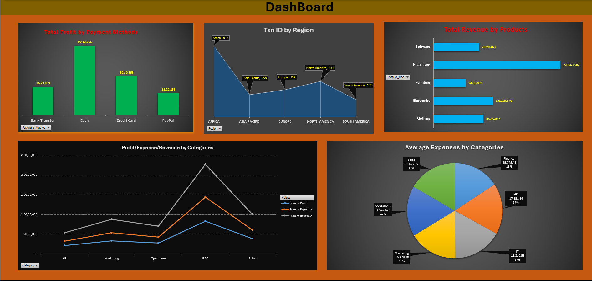

# 💸 Data Analytics Excel Project - UPI Transactions

This project analyzes **UPI (Unified Payments Interface)** transaction data using Microsoft Excel. It features a **clean dashboard**, **interactive pivot tables**, and **category-wise analysis** of financial activity to provide valuable insights into personal or organizational digital transactions.

---

## 📸 Dashboard Preview

  
*Sample view of the Excel Dashboard with slicers and charts*

---

## 🧠 Project Goals

- Analyze UPI transaction trends over time  
- Categorize and summarize spending  
- Identify most frequent payees and highest value transactions  
- Visualize refunds and reversals

---

## 🧰 Tools & Features Used

- **Microsoft Excel**
  - Pivot Tables
  - Pivot Charts
  - Slicers for interactivity
  - Conditional Formatting
  - VLOOKUP / IF / SUMIF formulas

---

## 🔍 Key Insights Extracted

- 📅 **Month-wise Spending**: Identified peaks and dips in transaction volume  
- 📂 **Category Distribution**: Tracked where money goes (shopping, bills, friends, etc.)  
- 💰 **Top Transactions**: Highlighted largest debits and most frequent payees  
- ♻️ **Refund Trends**: Spotted refund or failed payment patterns

---

